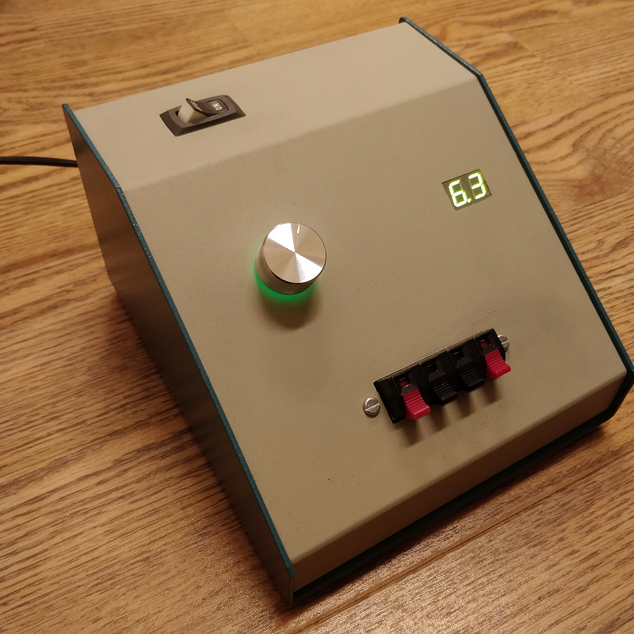
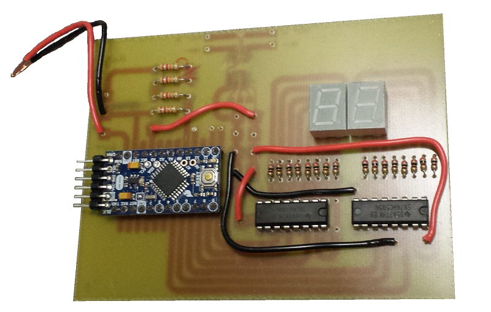

# PowerSupply
## An Arduino-controlled benchtop power supply

### Features
* 3.8 to 19.5 VDC output
* Up to 3A continuous current
* Display voltage or current
* RGB LED knob

### Components
* Arduino Pro Mini 328 (5v/16MHz)
* 40W Laptop charger for AC/DC conversion
* Illuminated RGB encoder (Sparkfun COM-10982)
* 7-Segment LED display (x2)
* SN74HC595N 8-bit Shift Register (x2)
* 200Ω resistor (16x)
* MCP41HV51 high voltage digital potentiometer
* 22K resistor (4x for voltage divider)
* ACS712 hall-effect current sensor (Sparkfun BOB-08882)
* Toggle switch, max 15A DC (took this one from a vacuum cleaner)
* 4-contact spring terminal block (Digikey GC400-ND)
* LM2596-based DC buck converter (x2)
* A nifty aluminum box

### PCB
Custom PCB schematics designed with CircuitMaker, available [here](https://workspace.circuitmaker.com/Projects/Details/Colin-Bott/Variable-Power-Supply)

### Planned Improvements
- [ ] System check on startup
- [ ] Constant-current mode
- [ ] Battery charger mode
- [ ] Overcurrent protection
- [ ] Diode/reverse voltage protection
